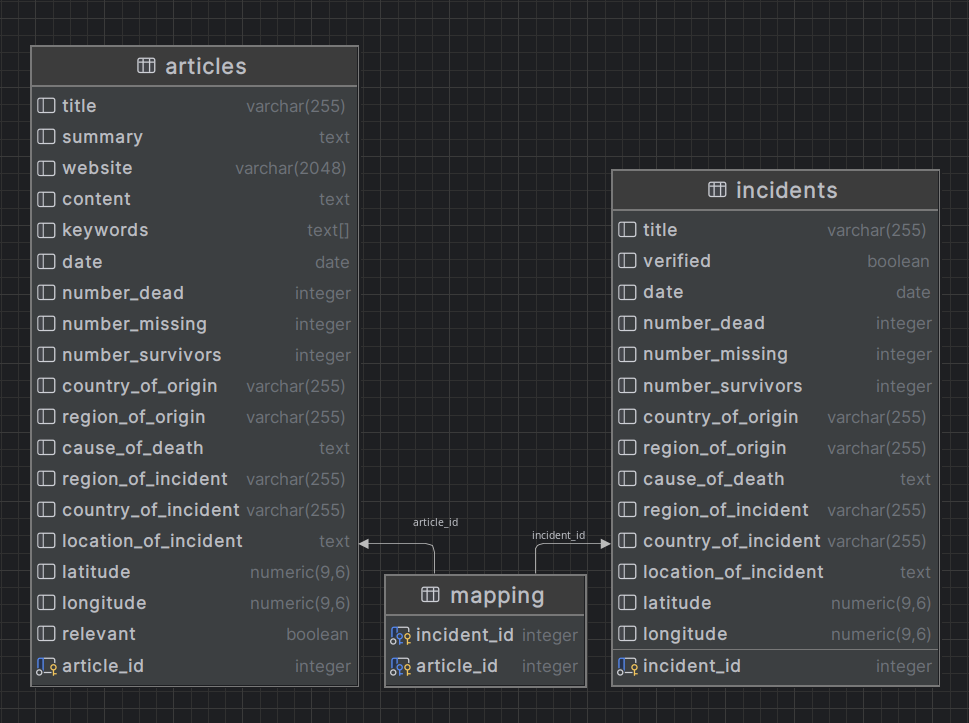

# Missing Migrants Backend

This is the backend for the Missing Migrants project. It is responsible for processing the data collected by the scraper, and providing a set of API endpoints for the frontend to use.

## Technologies Used

- **Language**: Python
- **Framework**: FastAPI
- **Database**: PostgreSQL

## Setup and Installation

1. Clone the repository: `git clone https://github.com/DataWave-Bodensee/backend.git`
2. Navigate to the project directory: `cd backend`
3. Start the server: `docker compose up`

## Deployment

The backend is containerized using `Docker` and deployed on `Microsoft Azure`.

